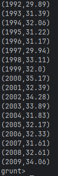
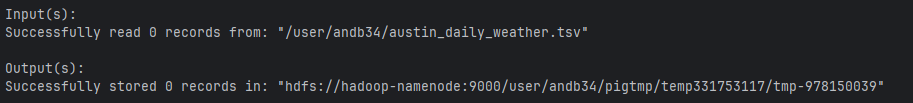

### Q1
The Pig script loads daily weather data for Austin and selects the date and the maximum daily temperature. From the date, the year is extracted and all records are grouped by year. For each year, the script computes the maximum value of the daily maximum temperatures.
The final output consists of pairs (year, temperature), where the temperature is the highest daily temperature recorded in Austin in that year, expressed in degrees Fahrenheit.


### Q2

I have created max_temps_celcius.pig file to compute the same data but in Celsius.
I just introduced a new step (recs6) to convert the temperature from Fahrenheit to Celsius using the formula: C = (F - 32) * 5/9. The result is rounded to two decimal places for better readability.

```pig
set pig.temp.dir /user/andb34/pigtmp
recs = load '/user/andb34/austin_daily_weather.tsv';
recs2 = FOREACH recs GENERATE $2, $3;
recs3 = FOREACH recs2 GENERATE SUBSTRING($0,0,4), $1;
recs4 = GROUP recs3 BY $0;
recs5 = FOREACH recs4 GENERATE group, MAX(recs3.$1);
recs6 = FOREACH recs5 GENERATE $0, ROUND(($1 - 32.0) * (5.0 / 9.0) * 100.0) / 100.0;
dump recs6;
```



### Q3

I have created max_temps_diff.pig file to compute the difference between the maximum and minimum daily temperatures recorded in Austin for each year.
The final output consists of pairs (year, difference), where difference is the difference between the maximum and minimum daily temperatures recorded in Austin for that year.

```pig
set pig.temp.dir /user/andb34/pigtmp
recs = LOAD '/user/andb34/austin_daily_weather.tsv'
       USING PigStorage('\t')
       AS (
           c1:chararray,
           c2:chararray,
           date:chararray,
           tmax:double,
           c5:chararray,
           tmin:double
       );
recs2 = FOREACH recs GENERATE SUBSTRING(date, 0, 4) AS year, tmax, tmin;
recs3 = GROUP recs2 BY year;
recs4 = FOREACH recs3 GENERATE group AS year, MAX(recs2.tmax) AS max_temp, MIN(recs2.tmin) AS min_temp;
recs5 = FOREACH recs4 GENERATE year, (max_temp - min_temp) AS temp_diff;
recs6 = ORDER recs5 BY temp_diff DESC;
recs7 = LIMIT recs6 1;
DUMP recs7;
```

