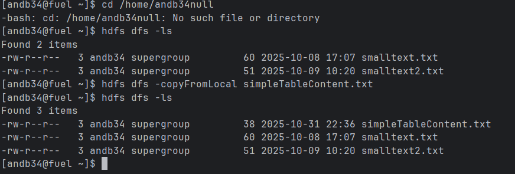
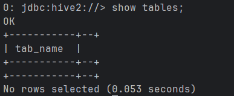
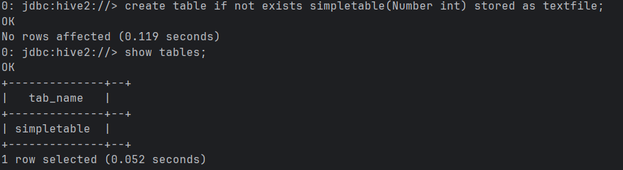
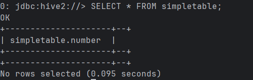
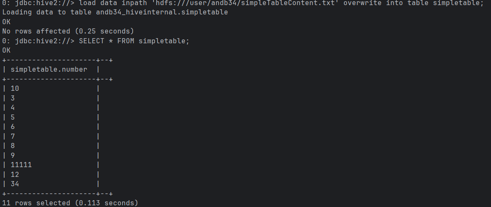
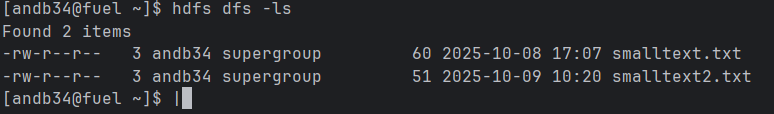
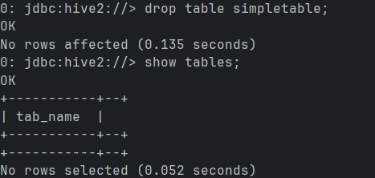
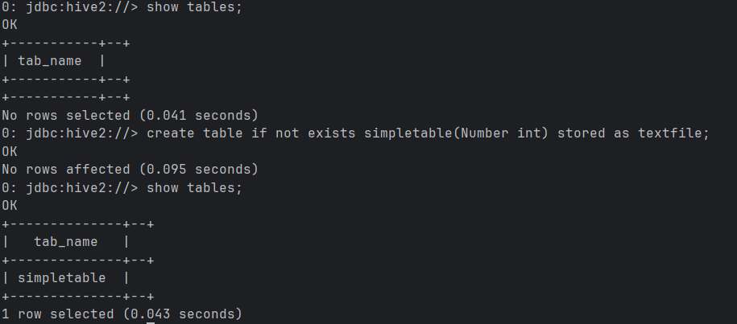
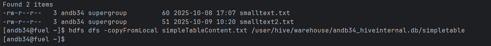
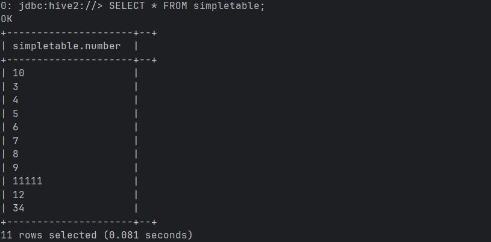

## Task 1

Before copying the file and after copying the file

Before creating table in database

After creating table in database

Before loading the data into simpleTable

After loading the data into simpleTable

Hadoop after loading the file into simpleTable

Dropping the table simpleTable

## Task 2
Once again creating simpleTable

Copying from local directly to hive metastore

Running query to see if hive got the file and inserted it into proper table

