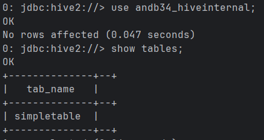
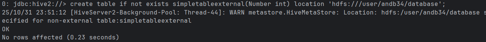
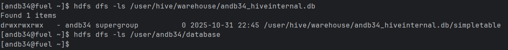
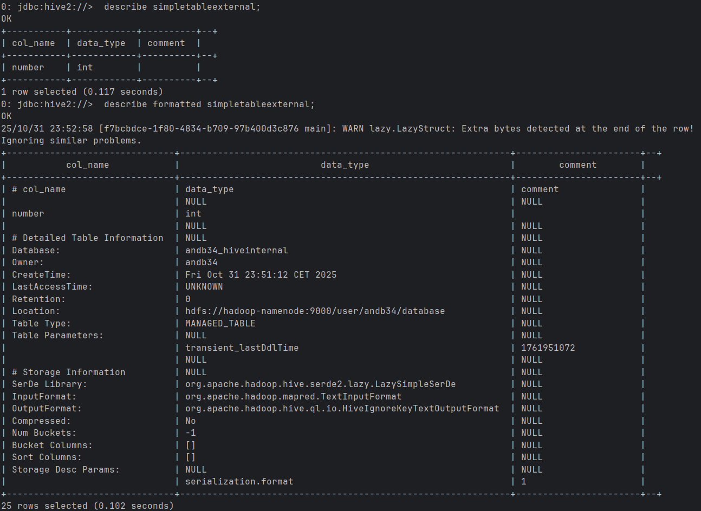
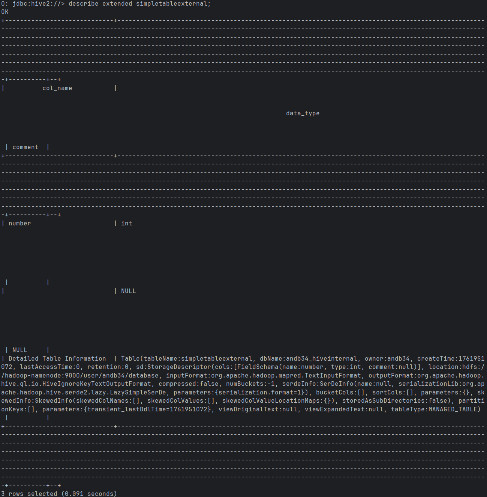
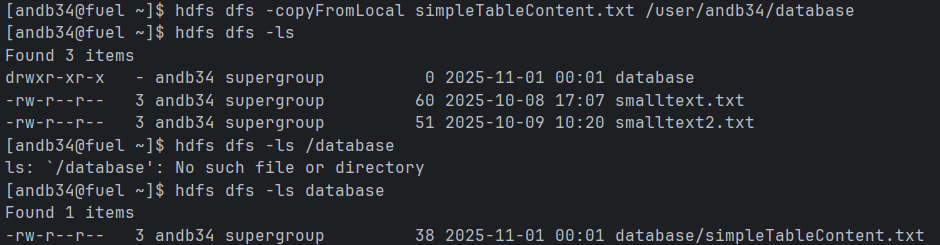
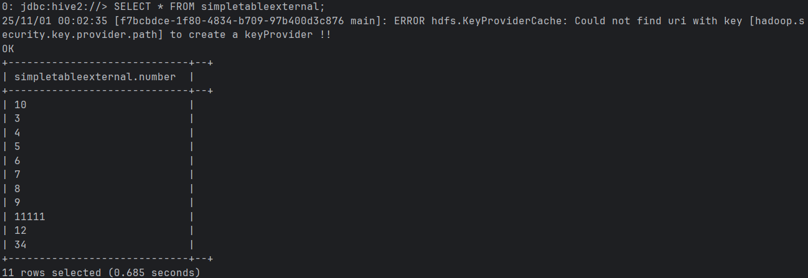
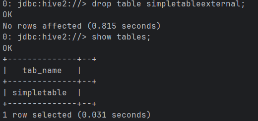
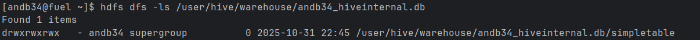

Using my database and showing existing tables

Creating new table inside the database

At this point this is the content of the hdfs local and remote (there is nothing in the database dir yet)

Lets check the table metadata / using formatted option

the important line is this one:
Location: | hdfs://hadoop-namenode:9000/user/andb34/database

Also lets try the extended option in describe command

Copy the files from hadoop client to the database

Lets check the content with the simple query

Finally, drop the table and check the remote hdfs

