Creating a new table in my database, textfile with 2 columns, char and int, delimited by '|'

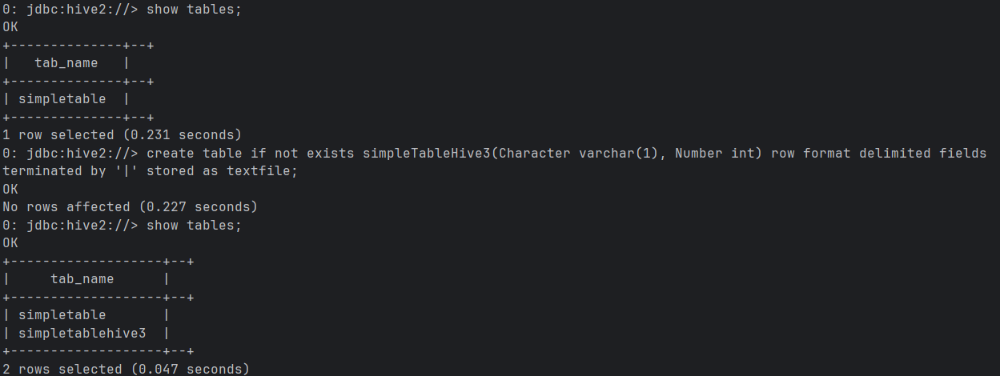

Copying files from local to database dir

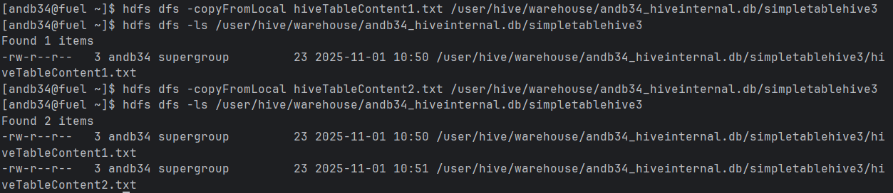

Looks like data is there

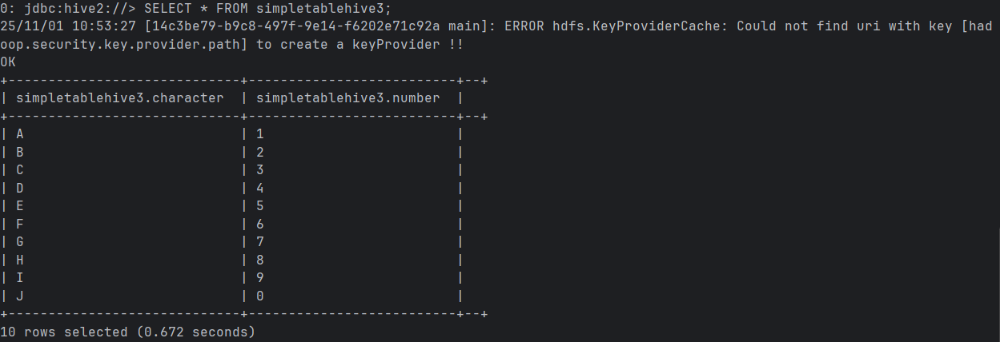

Sequence file table creation

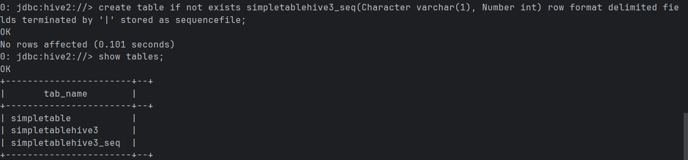

Insertion of data into a new table Sequence

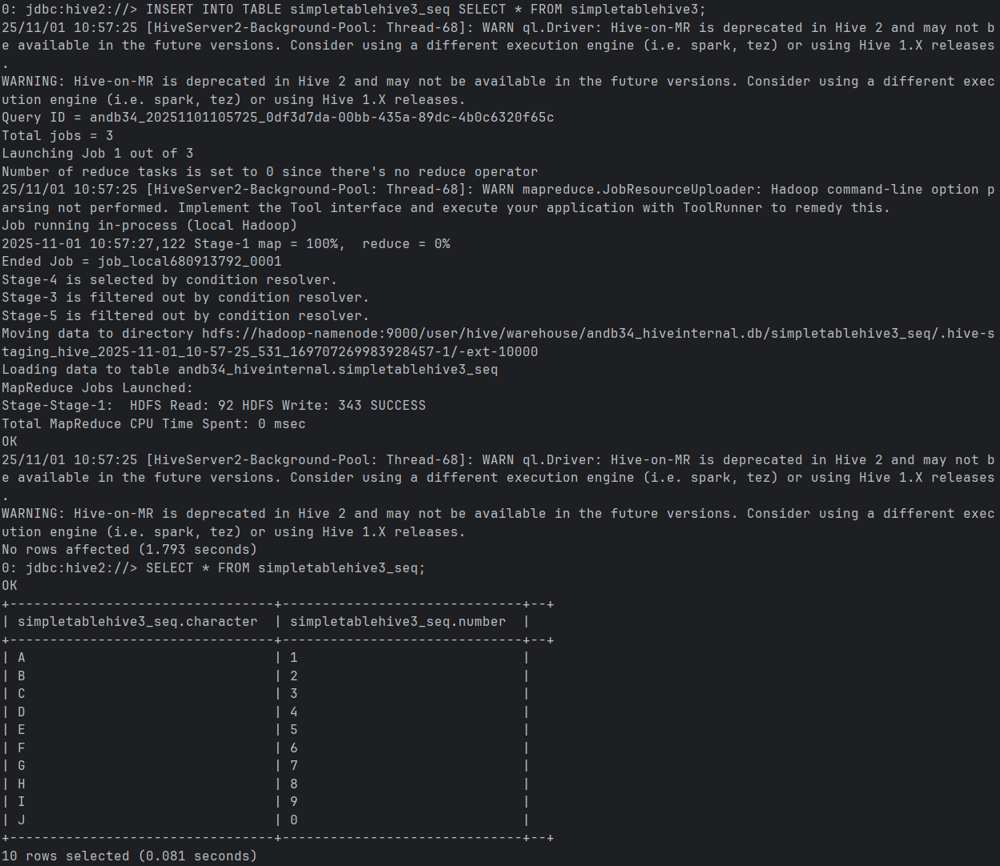

In a directory of sequence table there is a binary file which cannto be loaded

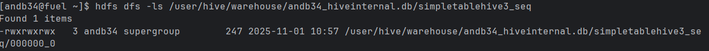

RCFile table creation

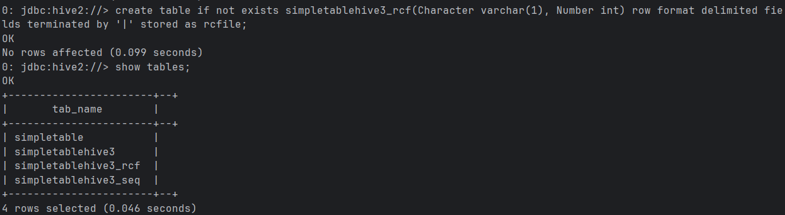

Insertion of data into a new table RCFile

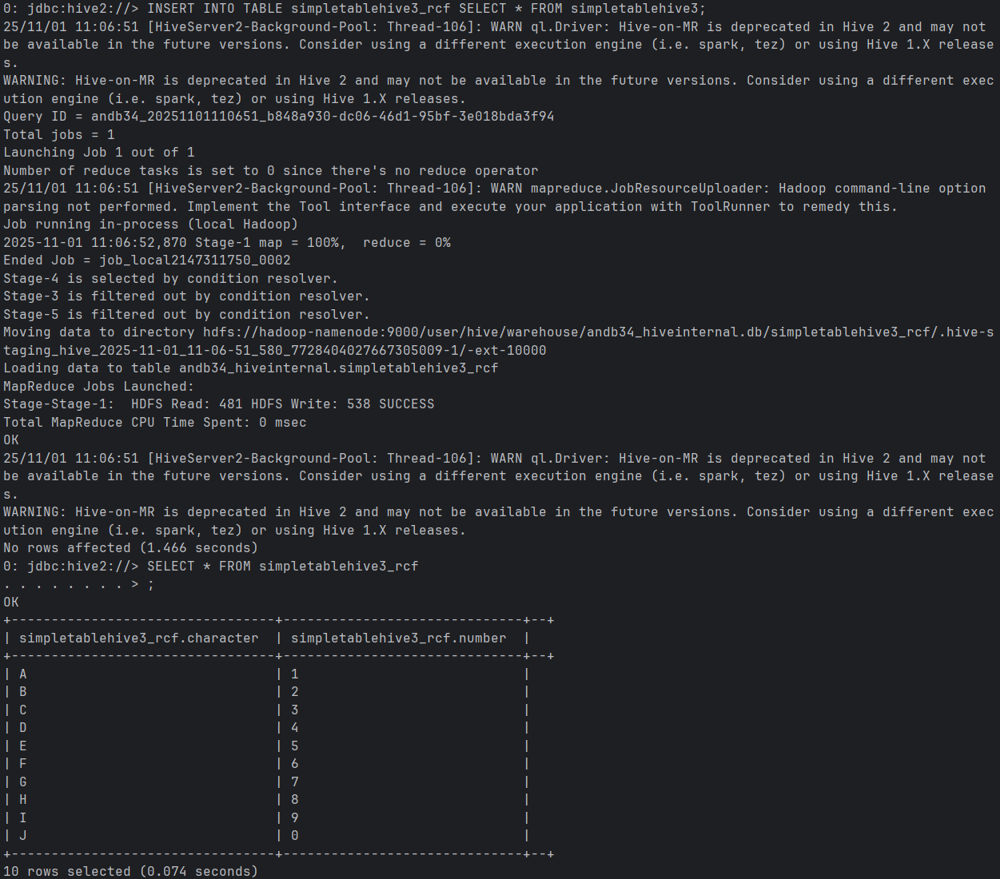

Again, in a directory of RCFile table there is a binary file which cannot be loaded

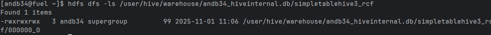

ORC table creation

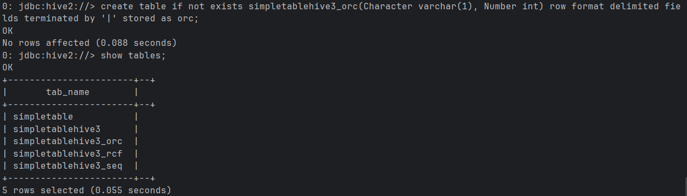

Insertion of data into a new table ORC

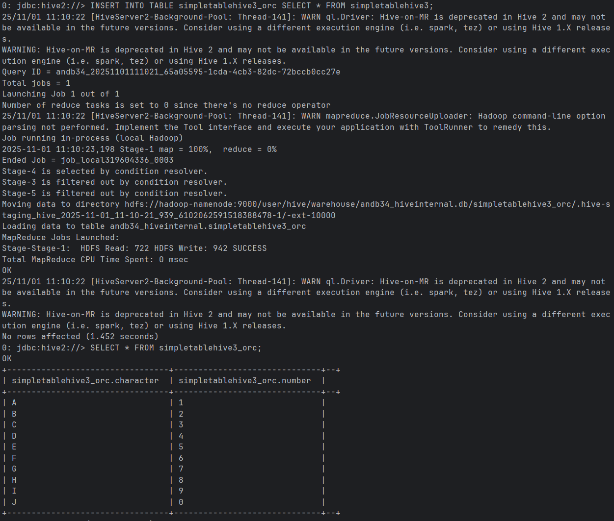

Again, in a directory of ORC table there is a binary file which cannot be loaded

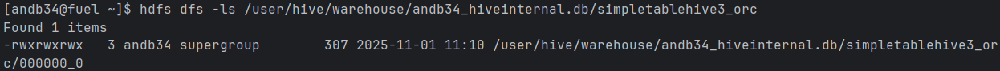

Parquet table creation

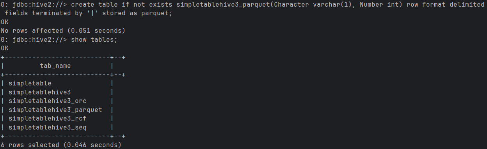

Insertion of data into a new table Parquet

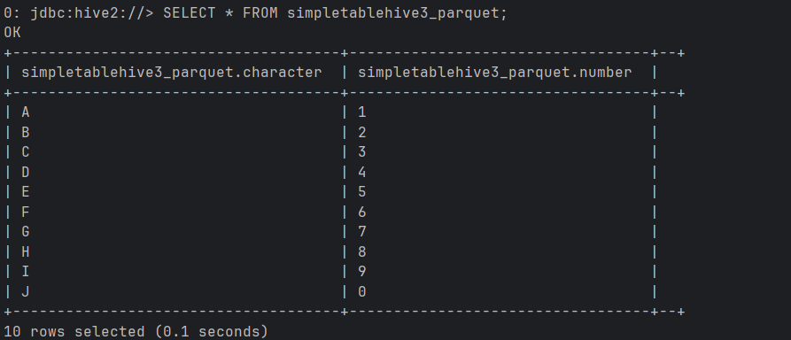

Again, in a directory of Parquet table there is a binary file which cannot be loaded

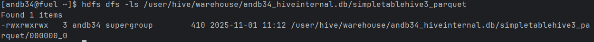

## Characteristics breakdown

simpletablehive3:

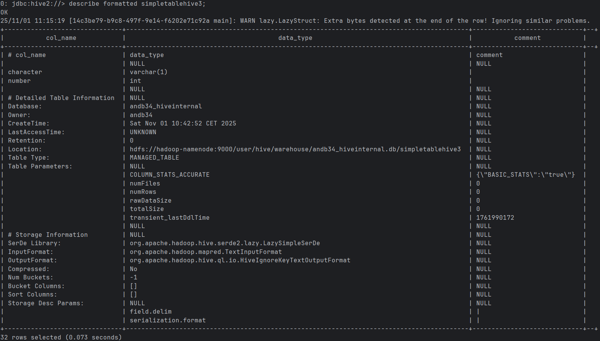

simpletablehive3_seq:

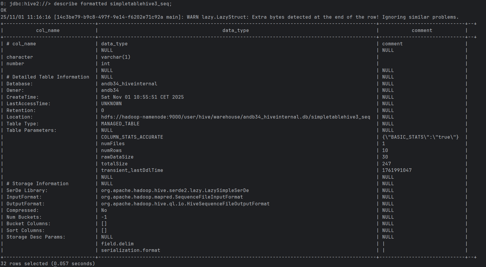

simpletablehive3_rcf:

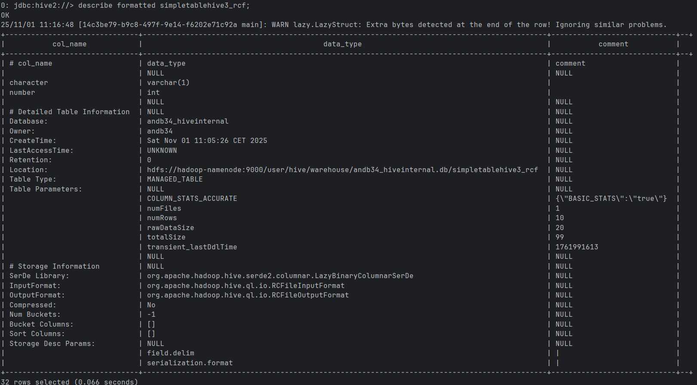

simpletablehive3_orc:

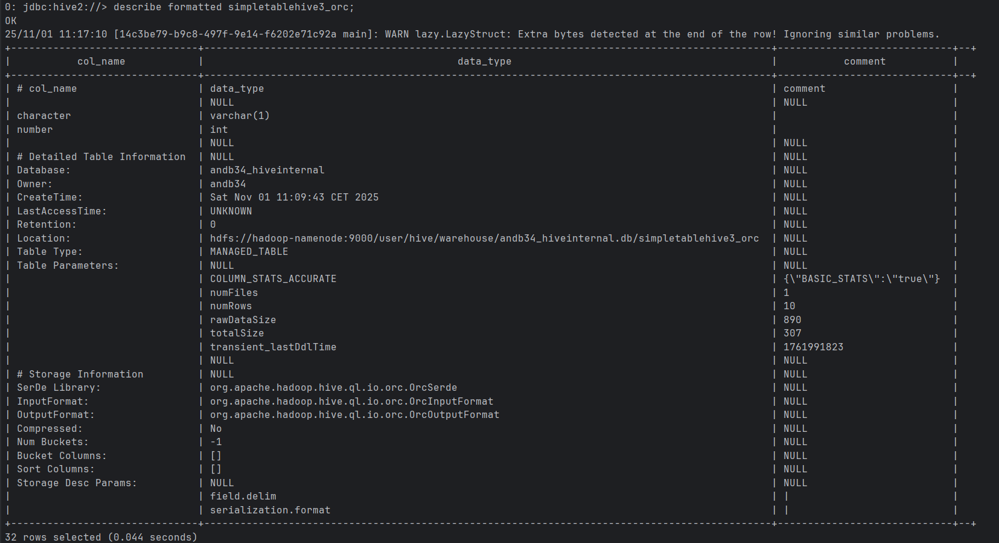

simpletablehive3_parquet:

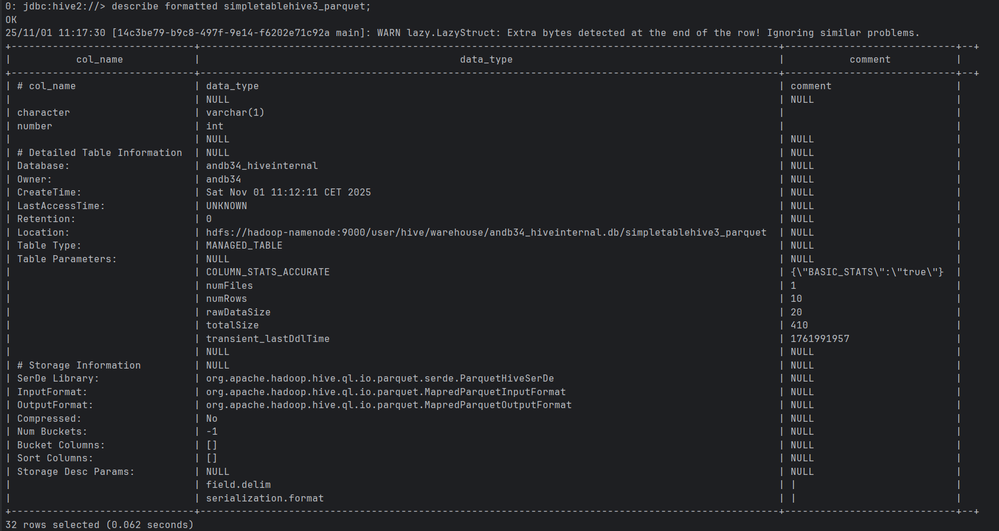

Lastly, droping the tables

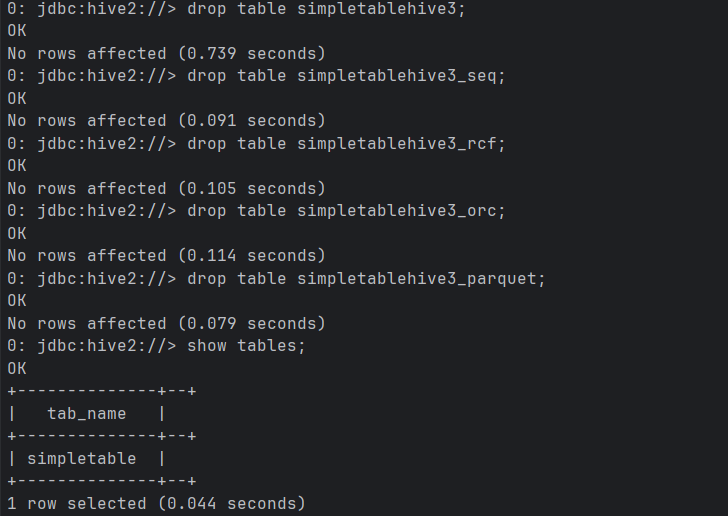
