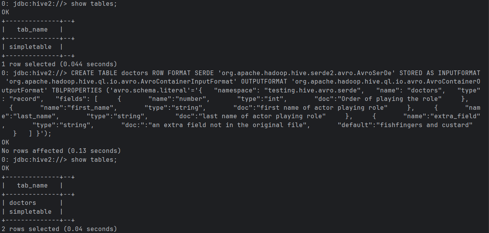
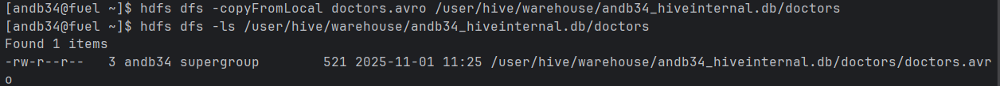
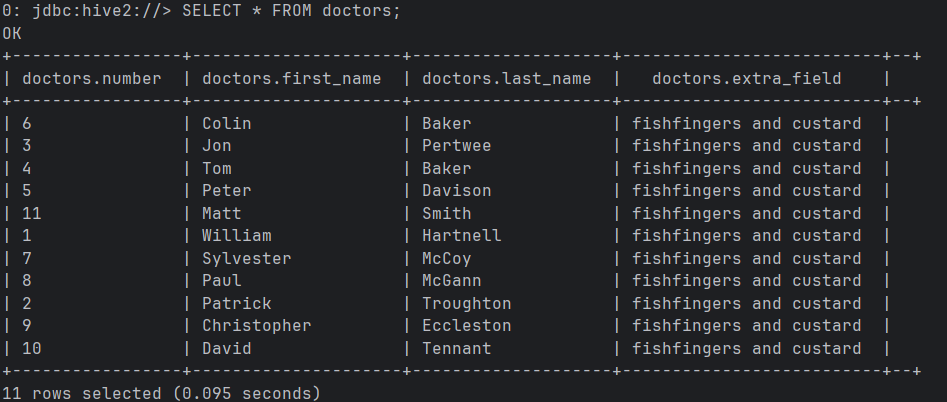
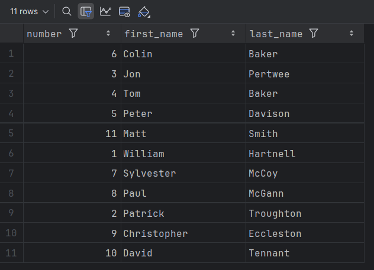
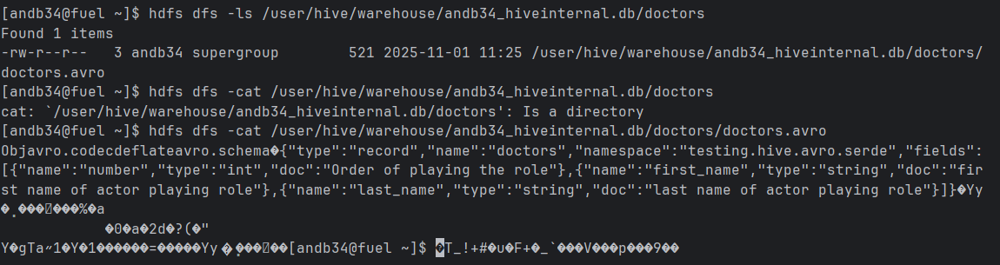
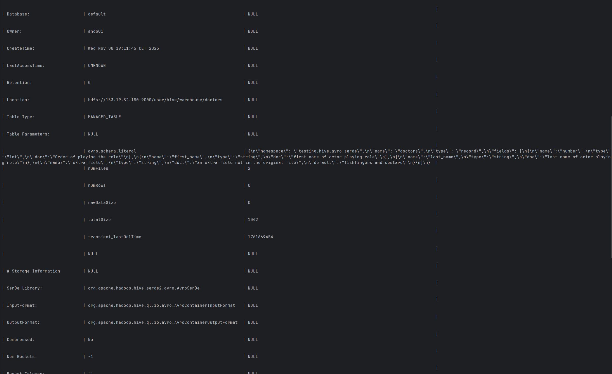

Creating table for doctors in AVRO format

Copying the doctos.avro file 

Showing data in the doctos table

Doctors.avro file, here is worth noting that the extra fields are using default values as defined in the data creation schema

Checking the content of the directory in which the doctors data is stored

Characteristics of avro table (metadata). We may observe that there are some .avro types, which is obviously related to the fact that the data is stored in avro format,
For example, we see that an I/O format is avro.

