Creating the table and showing the created table.

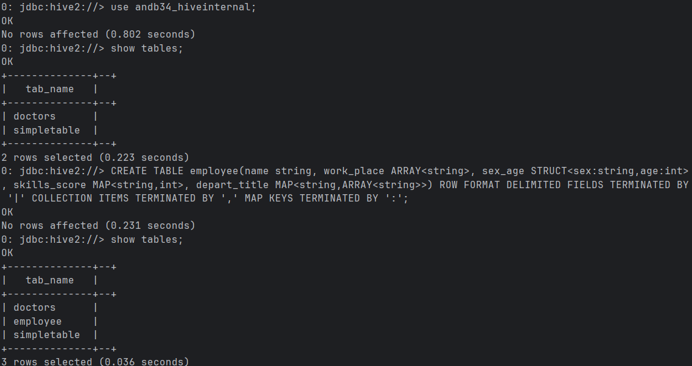

File employee.txt examination: Values in the column named depart_title are stored in arrays in string type. 
Values are separated by, a typical for nested collection structures, the control character (end of transmission)
Here: https://www.ascii-code.com/characters/control-characters, the character is labeled as the Code 4.
Values are separated by the pipe character '|'.

Here is the peek for the data in employee.txt:

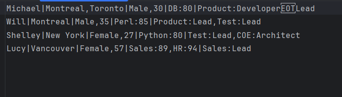

Lets now load the data into the table:

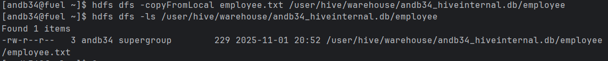

And see if the data is loaded:

Now, we will run some queries:

Query a:

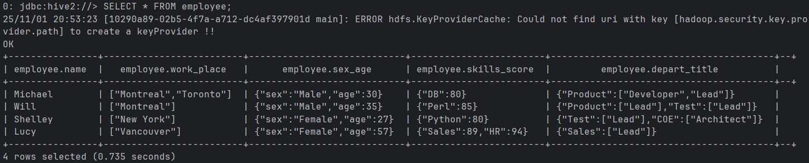

Query b:

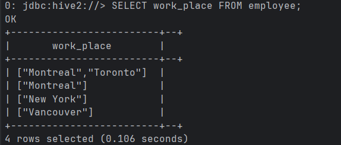

Query c:

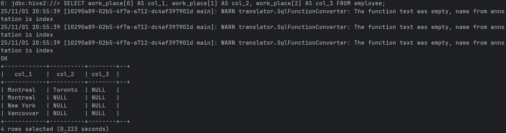

Query d:

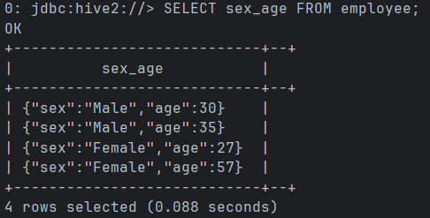

Query e:

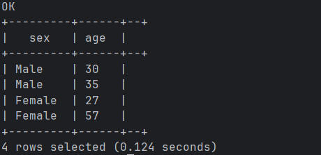

Query f:

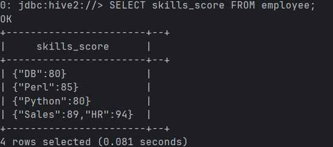

Query g:

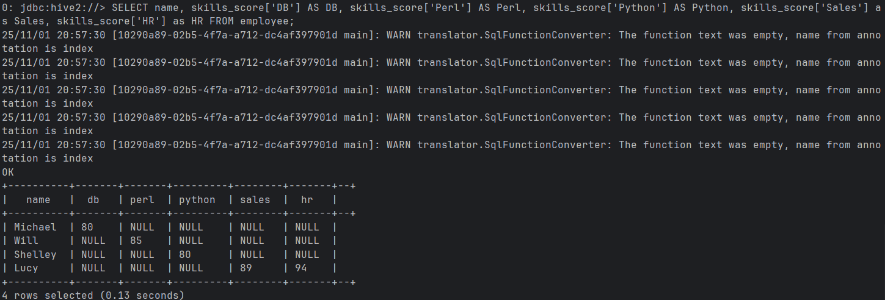

Query h:

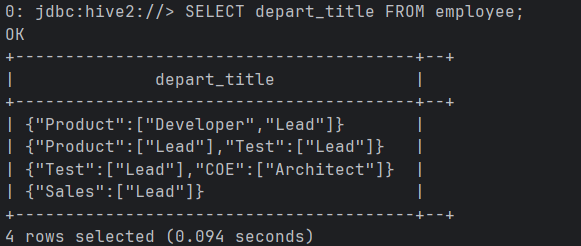

Query i:

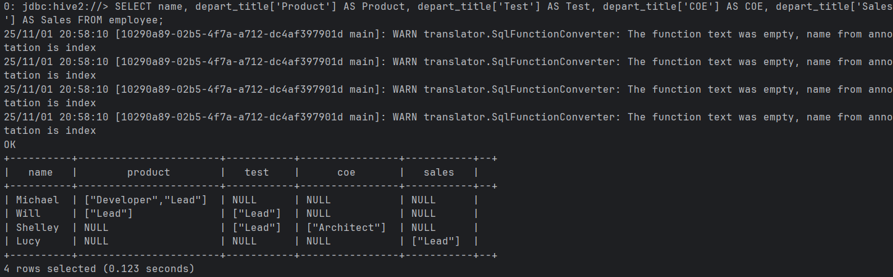

Query j:

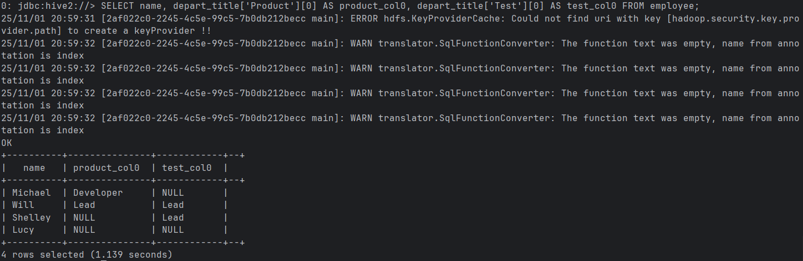

Load data into hadoop from local

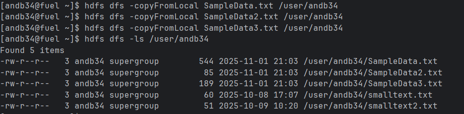

Tables were created in Hive.

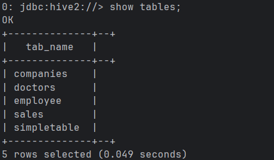

Load data into sales

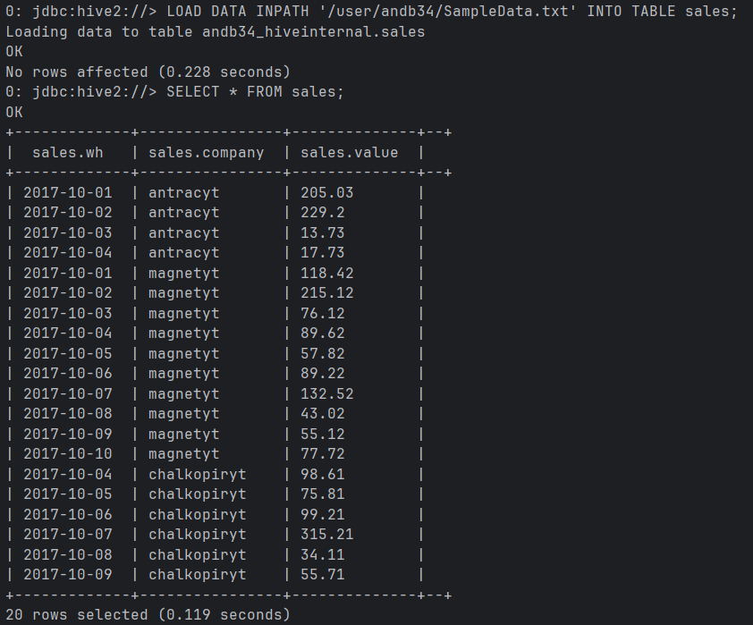

Load data into companies

Running select statement with JOIN clause

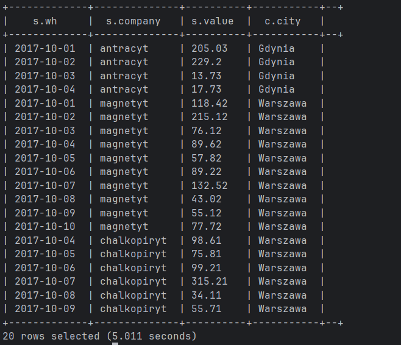

This query is showing date, company, city and value from joined tables - sales and comapnies.
Join is invokin a hive job which can be seen in the logs. It is processing a local map reduce job - join.

Creating companies2 table

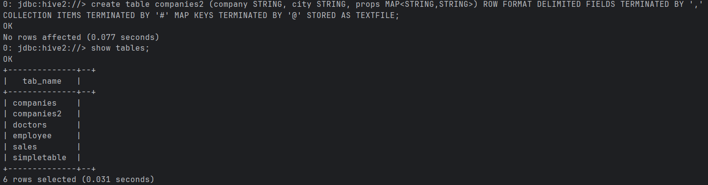

Load data into companies2 and see if it is loaded

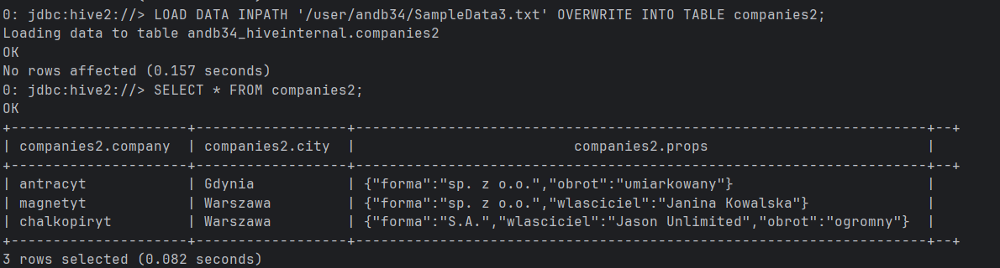

Running select statement with JOIN clause

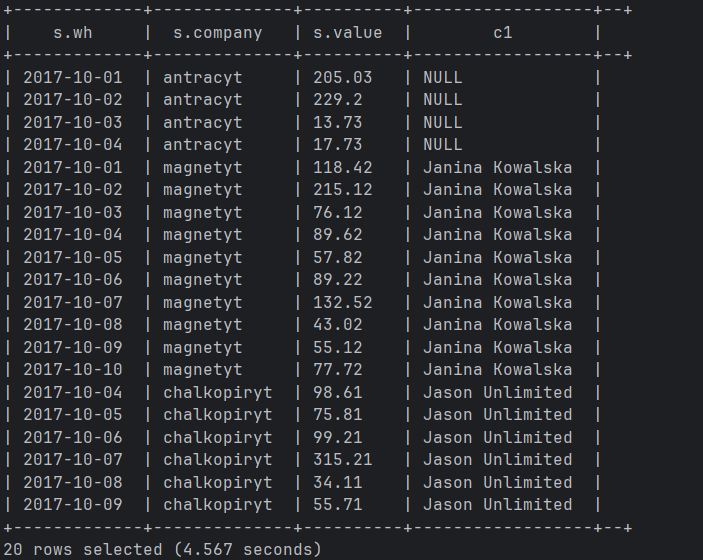

This query is also showing date, company, value and in this case the owner for every sale.
This is also the same case as in the previous query - map reduce job is running.

