Creating table

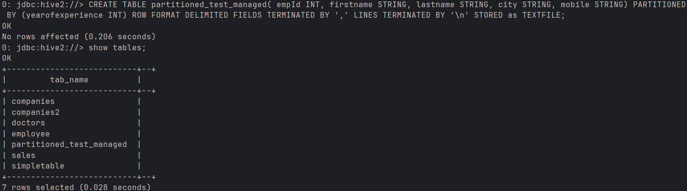

Load data and see if its in the table

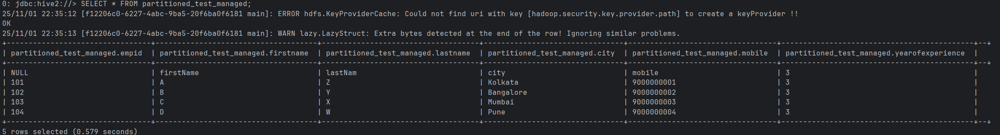

The column yearsofexperience was automatically assigned a value '3' since  all columns in the files which are connected to a parition column
are skipped and rows get parition assigned during the create statement. For id=104 the yearofexperience was changed from value '5' to '3'.

Creating non-paritioned table and showing it

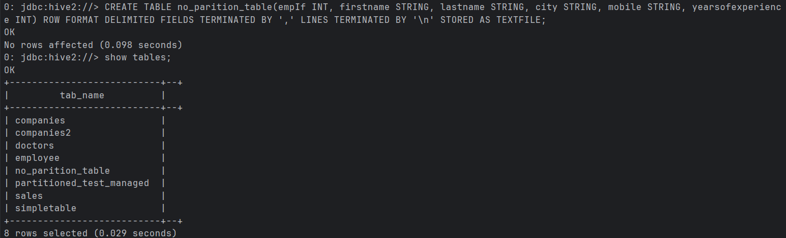

Loading data into the table and checking if it loaded properly

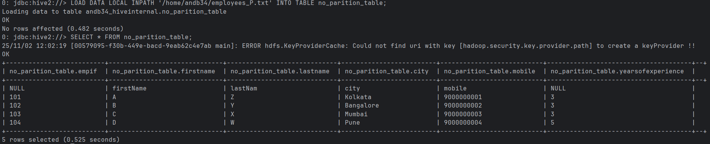

Creating the second paritioned table called partitioned_test_managed_DP and checking if it was created properly

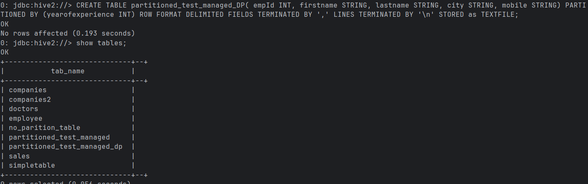

Changing the options of hive execution engine

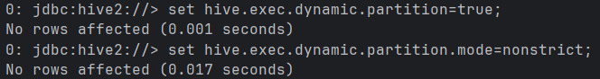

Loading data into paritioned_test_managed_DP and checking if it was loaded properly

The number of partitions is 3, because values that can be observed in 'yearofexperience' are '3', '5' or NULL.
We can also see the difference if we display the partitions:

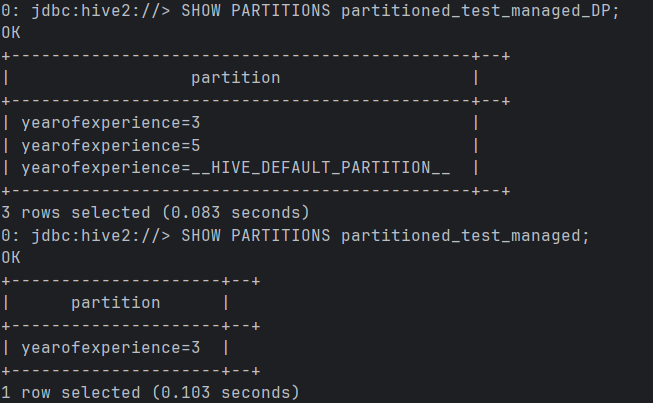

Using DESCRIBE function does not show any particular difference between the two tables.

Creating the table partitioned_test_managed_PC and checking if it was created properly

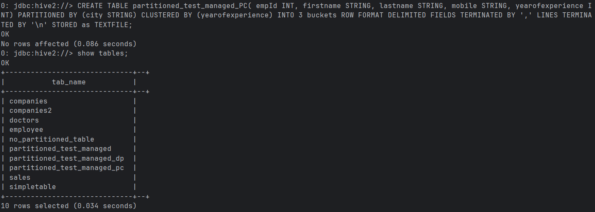

Loading data into partitioned_test_managed_PC and checking if it was loaded properly

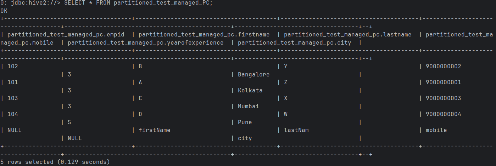

Checking the metadata of the new table

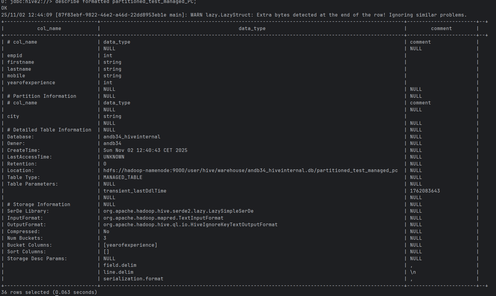sshow

Check the partitioning and bucketing for each partition

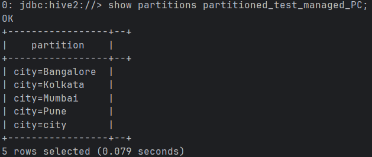

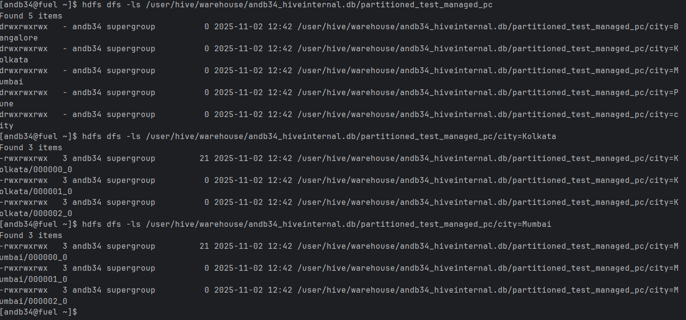

So the partitioned cities are then divided into buckets based on yearofexperience (so the 3 files in each), they are stored in binary files

